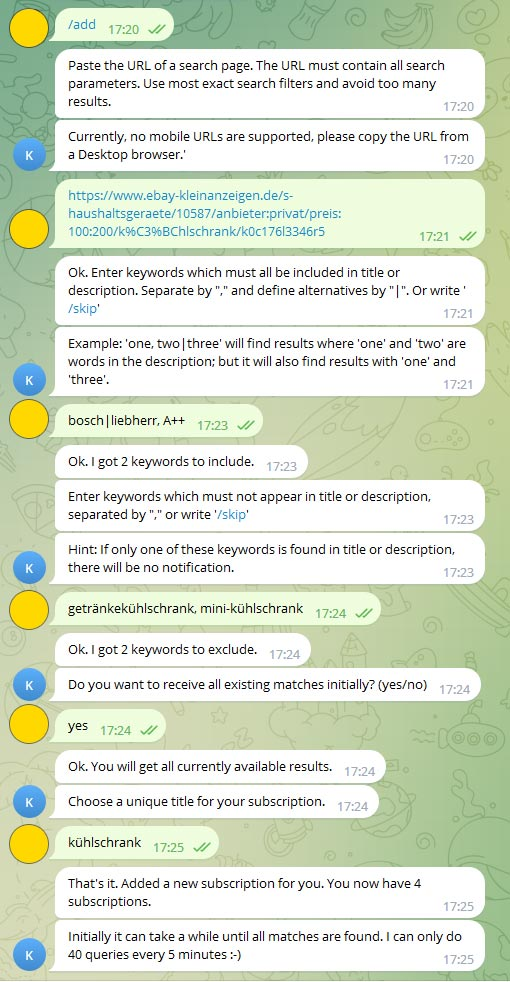

# EbayKleinanzeigenCrawler
.NET 6 based crawler that parses Ebay Kleinanzeigen classified ads and notifies via a Telegram Bot.

# Currently supported providers
* ebay-kleinanzeigen.de
* zypresse.com

# Features:
* Notifies you reliably about new articles within 0-5 minutes!
* Searches for keywords in title and description!
* Specify which search keywords to include and which to exclude!
* Specify a subscription by simply copying the URL from your browser
* Uses Telegram as interface for notifications and control
* Supports multiple Subscribers and Subscriptions
* You can easily add different interfaces (Console, E-Mail, SMS, ...)
* Persists data in JSON files

# Before use:
* Create your own Telegram Bot
* Modify the `.env` file and set the environment variable `TELEGRAM_BOT_TOKEN` to your token.
* If you you want to test it without Telegram, set the environment variable `NOTIFICATION_MANAGER` to `CONSOLE` to get notifications along with the logs on the console.

# How to use:
* (After each change to the code) Build the app with `docker-compose build`
* Start the container with `docker-compose up`
* Send /help to the Telegram bot for instructions
* Currently no mobile browser links are supported, it only works with Desktop-Browser links (e. g. https://www.ebay-kleinanzeigen.de/....)
* Ebay Kleinanzeigen blocks requests when there are too many requests. This software considers this limit.
* This software is work in progress. There are many TODOs in the code. Feel free to contribute :-)

## Example usage

# Developing within a VSCode Devcontainer
* Download the VSCode Extension [Remote Containers](https://marketplace.visualstudio.com/items?itemName=ms-vscode-remote.remote-containers)
* Create a `.env`-file in the repository root and set the variable `TELEGRAM_BOT_TOKEN=<TOKEN>` if you don't want to set it manually later
* Open the Command Palette via View → Command Palette or using the shortcut `CTRL + SHIFT + P`
* Run Remote-Containers: Reopen in Container (Rebuild and Reopen at the initial startup)
* If you haven't setup the Telegram Token environment variable using a `.env`-file, enter `export TELEGRAM_BOT_TOKEN=<TOKEN>` into the console
* Change directory into `EbayKleinanzeigenCrawler` and start the project with `dotnet run` or `dotnet run --watch`